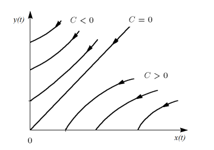
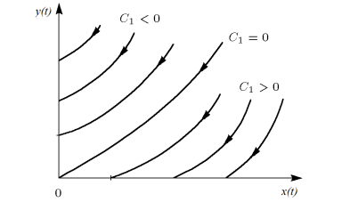

# Модель боевых действий
## Выполнил Бабков Дмитрий Николаевич
Группа: НФИбд-01-20, №Студенческого билета: 1032201726

---

# Введение

Моделирование боевых действий может быть трёх видов
1. Между двумя регулярными армиями
2. Между регулярной армией и партизанскими отрядами
3. Между партизанскими отрядами
   
Будем рассматривать только первые два вида.

---

В первом случае численность регулярных войск определяется тремя факторами:

- скорость уменьшения численности войск из-за причин, не связанных с боевыми действиями (болезни, травмы, дезертирство);
- скорость потерь, обусловленных боевыми действиями противоборствующих сторон (что связанно с качеством стратегии, уровнем вооружения, профессионализмом солдат и т.п.);
- скорость поступления подкрепления (задаётся некоторой функцией от
времени).
В этом случае модель боевых действий между регулярными войсками
описывается следующим образом

$$\frac{dx}{dt} = -a(t)x(t)-b(t)y(t)+P(t)$$
$$\frac{dy}{dt} = -c(t)x(t)-h(t)y(t)+Q(t)$$

---

$-a(t)x(t)$ и $h(t)y(t)$ описывают потери, не связанные с боевыми действиями, $-b(t)y(t)$ и $-c(t)x(t)$ отражают потери на поле боя. Функции $P(t)$ и $Q(t)$ учитывают возможность подхода подкрепления в течение одного дня.

---

Во втором случае в борьбу добавляются партизанские отряды. Нерегулярные войска в отличии от постоянной армии менее уязвимы, так как действуют скрытно, в этом случае сопернику приходится действовать неизбирательно, по площадям, занимаемым партизанами. Поэтому считается, что тем потерь партизан, проводящих свои операции в разных местах на некоторой известной территории, пропорционален не только численности армейских соединений, но и численности самих партизан. В результате модель принимает вид:

$$\frac{dx}{dt} = -a(t)x(t)-b(t)y(t)+P(t)$$
$$\frac{dy}{dt} = -c(t)x(t)y(t)-h(t)y(t)+Q(t)$$

В этой системе все величины имеют тот же смысл.

---

# Жёсткая модель войны

В простейшей модели коэффициенты $b(t)$ и $c(t)$ являются постоянными. Также не учитываются потери, не связанные с боевыми действиями, и возможность подхода подкрепления. Состояние системы описывается точкой (x,y) положительного квадранта плоскости. Координаты этой точки, x и y - это численности противостоящих армий. Тогда модель принимает вид 

$$
\begin{equation*} 
 \begin{cases}
   \frac{dx}{dt} = -by
   \\
   \frac{dy}{dt} = -cx
   
 \end{cases}
\end{equation*}
$$

---

Такая модель допускает точное решение 

$$\frac{dx}{dy} = \frac{by}{cx}$$
$$cxdx = bydy, cx^2-by^2 = C$$

Эволюция численностей армий x и y происходит вдоль гиперболы: 

--- 

Если рассматривать второй случай, то данная модель принимает вид

$$\frac{dx}{dt} = -by(t)$$
$$\frac{dy}{dt} = -cx(t)y(t)$$

Эта система приводится к уравнению 

$$\frac{d}{dt}(\frac{b}{2}x^2(t) - cy(t)) = 0$$

которое имеет единственное решение :
$$\frac{b}{2}x^2(t)-cy(t) = \frac{b}{2}x^2(0)-cy(0) = C_1$$

---

---

# Спасибо за внимание