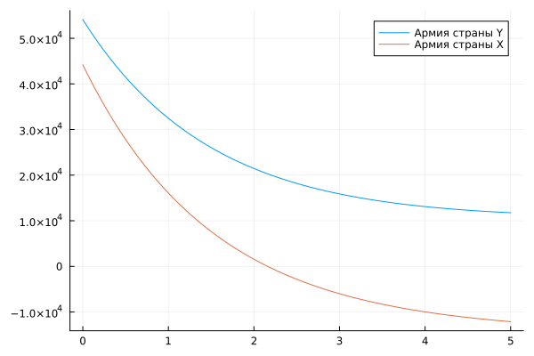
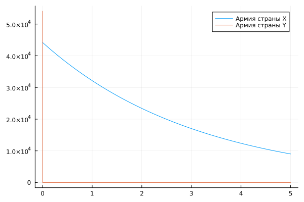
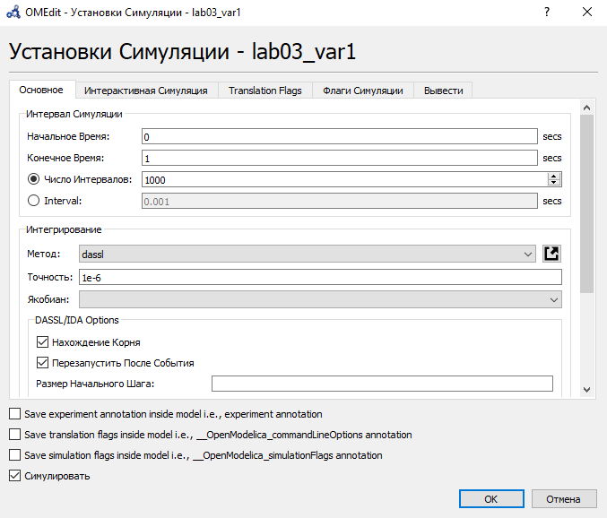
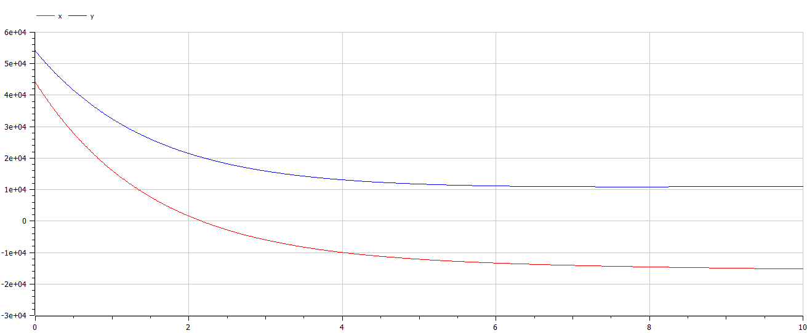
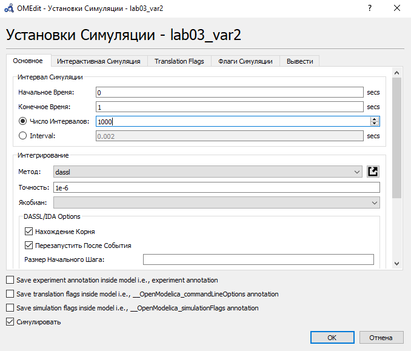
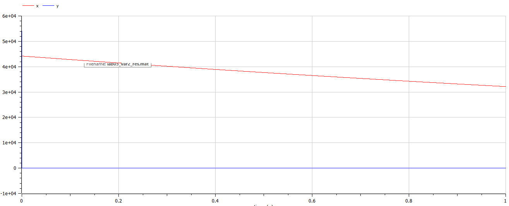

---
## Front matter
title: "Отчёт по лабораторной работе №3"
subtitle: "Вариант 67"
author: "Бабков Дмитрий Николаевич"

## I18n polyglossia
polyglossia-lang:
  name: russian
  options:
	- spelling=modern
	- babelshorthands=true
polyglossia-otherlangs:
  name: english
## I18n babel
babel-lang: russian
babel-otherlangs: english
## Fonts
mainfont: PT Serif
romanfont: PT Serif
sansfont: PT Sans
monofont: PT Mono
mainfontoptions: Ligatures=TeX
romanfontoptions: Ligatures=TeX
sansfontoptions: Ligatures=TeX,Scale=MatchLowercase
monofontoptions: Scale=MatchLowercase,Scale=0.9
## Biblatex
biblatex: true
biblio-style: "gost-numeric"
biblatexoptions:
  - parentracker=true
  - backend=biber
  - hyperref=auto
  - language=auto
  - autolang=other*
  - citestyle=gost-numeric
## Pandoc-crossref LaTeX customization
figureTitle: "Рис."
tableTitle: "Таблица"
listingTitle: "Листинг"
lofTitle: "Список иллюстраций"
lotTitle: "Список таблиц"
lolTitle: "Листинги"
## Misc options
indent: true
header-includes:
  - \usepackage{indentfirst}
  - \usepackage{float} # keep figures where there are in the text
  - \floatplacement{figure}{H} # keep figures where there are in the text
---

# Цель работы
Сделать модель боевых действий на языке Julia и в OpenModelica и сравнить результаты

# Задание
Между страной Х и страной У идет война. Численность состава войск
исчисляется от начала войны, и являются временными функциями $x(t)$ и $y(t)$. В начальный момент времени страна Х имеет армию численностью 44 200 человек, а в распоряжении страны У армия численностью в 54 100 человек. Для упрощения модели считаем, что коэффициенты постоянны. Также считаем, что $P(t)$ и $Q(t)$ непрерывные функции. Постройте графики изменения численности войск армии Х и армии У для следующих случаев:

1. Модель боевых действий между регулярными войсками
   $$\frac{dx}{dt} = -0.312x(t)-0.456y(t)+sin(t+3)$$
   $$\frac{dy}{dt} = -0.256x(t)-0.34y(t)+cos(t+7)$$

2. Модель боевых действий с участием регулярных войск и партизанских отрядов
   $$\frac{dx}{dt} = -0.318x(t)-0.615y(t)+|cos(8t)|$$
   $$\frac{dy}{dt} = -0.312x(t)y(t)-0.512y(t)+|sin(6t)|$$

# Теоретическое введение

Рассмотрим некоторые простейшие модели боевых действий – модели
Ланчестера. В противоборстве могут принимать участие как регулярные войска,
так и партизанские отряды. В общем случае главной характеристикой соперников
являются численности сторон. Если в какой-то момент времени одна из
численностей обращается в нуль, то данная сторона считается проигравшей (при
условии, что численность другой стороны в данный момент положительна).
Рассмотри три случая ведения боевых действий:

1. Боевые действия между регулярными войсками
2. Боевые действия с участием регулярных войск и партизанских отрядов
3. Боевые действия между партизанскими отрядами

В первом случае численность регулярных войск определяется тремя факторами:

- скорость уменьшения численности войск из-за причин, не связанных с боевыми действиями (болезни, травмы, дезертирство);
- скорость потерь, обусловленных боевыми действиями противоборствующих сторон (что связанно с качеством стратегии, уровнем вооружения, профессионализмом солдат и т.п.);
- скорость поступления подкрепления (задаётся некоторой функцией от
времени).
В этом случае модель боевых действий между регулярными войсками
описывается следующим образом

$$\frac{dx}{dt} = -a(t)x(t)-b(t)y(t)+P(t)$$
$$\frac{dy}{dt} = -c(t)x(t)-h(t)y(t)+Q(t)$$

$-a(t)x(t)$ и $h(t)y(t)$ описывают потери, не связанные с боевыми действиями, $-b(t)y(t)$ и $-c(t)x(t)$ отражают потери на поле боя. Функции $P(t)$ и $Q(t)$ учитывают возможность подхода подкрепления в течение одного дня.

Во втором случае в борьбу добавляются партизанские отряды. Нерегулярные войска в отличии от постоянной армии менее уязвимы, так как действуют скрытно, в этом случае сопернику приходится действовать неизбирательно, по площадям, занимаемым партизанами. Поэтому считается, что тем потерь партизан, проводящих свои операции в разных местах на некоторой известной территории, пропорционален не только численности армейских соединений, но и численности самих партизан. В результате модель принимает вид:

$$\frac{dx}{dt} = -a(t)x(t)-b(t)y(t)+P(t)$$
$$\frac{dy}{dt} = -c(t)x(t)y(t)-h(t)y(t)+Q(t)$$

В этой системе все величины имеют тот же смысл.

# Выполнение работы

## Julia

Открыв Pluto.jl я приступил к написанию кода. Сначала я подключил библиотеки Plots и DiffetentialEquations:
```
using Plots
using DiffetentialEquations
```

Далее я ввёл данные, приведённые в условии задачи:

```
x_0 = 44200
y_0 = 54100
a1 = 0.312
b1 = 0.456
c1 = 0.256
h1 = 0.34
a2 = 0.318
b2 = 0.615
c2 = 0.312
h2 = 0.512
```

Задал систему дифференциальных уравнений для первого случая ode_fn1

```
function ode_fn1(du, u, p, t) #Система дифф. уравнений, моделирующая изменение численностей армий X и Y
	x, y = u
	du[1] = -a1 * x - b1 * y + sin(t + 3)
	du[2] = -c1 * x - h1 * y + cos(t + 7)
end
```

Задал изменение времени и временной промежуток

```
dt1 = 0.01
tspan = (0, 5)
```

Ввёл начальные условия и решил систему дифференциальных уравнений

```
prob1 = ODEProblem(ode_fn1, [x_0, y_0], tspan)
sol1 = solve(prob1, dtmax = dt1)

diffX1 = [u[1] for u in sol1.u]
diffY1 = [u[2] for u in sol1.u]
diffT1 = [timestamp for timestamp in sol1.t]
```

C помощью plot и plot! отобразил графики изменения численности армий X и Y

```
plt1 = plot( #График изменения численности армии страны Y
	diffT1,
	diffY1,
	label = "Армия страны Y"
)

plot!( #Добавление графика изменения численности армии X
	diffT1,
	diffX1,
	label = "Армия страны X"
)
```


По нему видно, что армия страны X была полностью уничтожена где-то на $t = 2.2$

Аналогичным образом отображаю график изменения численностей армии для второго случая:

```
timespan = (0, 5)
dt2 = 0.01

function ode_fn2(du, u, p, t)
	x, y = u
	du[1] = -a2 * x - b2 * y + abs(cos(8 * t))
	du[2] = -c2 * x * y - h2 * y + abs(sin(6 * t))
end

prob2 = ODEProblem(ode_fn2, [x_0, y_0], timespan)

sol2 = solve(prob2, dtmax = dt2)

diffX2 = [u[1] for u in sol2.u]
diffY2 = [u[2] for u in sol2.u]
diffT2 = [timestamp for timestamp in sol2.t]

plt2 = plot(
	diffT2,
	diffX2,
	label = "Армия страны X"
)

plot!(
	diffT2,
	diffY2,
	label = "Армия страны Y"
)
```



По нему видно, что армия страны Y была уничтожена почти сразу же

## OpenModelica

Открыв OpenModelica я создал файлы lab03_var1 и lab03_var2 для первого и второго случаев соответственно

Код для первого случая:

```
model lab03_var1
  Real x;
  Real y;
  Real a = 0.312;
  Real b = 0.456;
  Real c = 0.256;
  Real h = 0.34;
  Real t = time;
initial equation
  x = 44200;
  y = 54100;
equation
  der(x) = -a * x - b * y + sin(t + 3);
  der(y) = -c * x - h * y + cos(t + 7);
end lab03_var1;
```

Далее я запустил симуляцию с определённым числом интервалов и продолжительностью:



Получившийся график полностью идентичен полученному на Julia:



Код для второго случая выглядит следующим образом:

```
model lab03_var2
  Real x;
  Real y;
  Real a = 0.318;
  Real b = 0.615;
  Real c = 0.312;
  Real h = 0.512;
  Real t = time;
initial equation
  x = 44200;
  y = 54100;
equation
  der(x) = -a * x - b * y + abs(cos(8 * t));
  der(y) = -c * x * y - h * y + abs(sin(6 * t));
end lab03_var2;
```

Далее я запустил симуляцию с определённым числом интервалов и продолжительностью:



Получившийся график полностью идентичен полученному на Julia:



График можно приблизить в интересующем нас месте:

.png)

Из этого можно увидеть, что армия страны Y очень быстро сократилась и стала околонулевой

# Вывод

Модель была построена на языках Julia и OpenModelica. Результаты получились идентичными, но в OpenModelica делать само задание и анализировать полученные результаты гораздо удобнее.