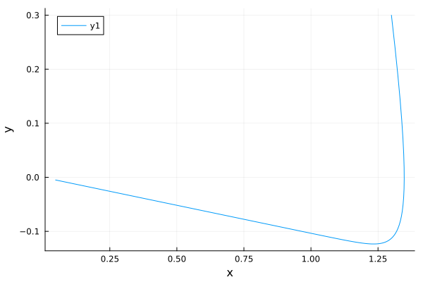

---
## Front matter
title: "Отчёт по лабораторной работе №4"
subtitle: "Вариант 67"
author: "Бабков Дмитрий Николаевич"

## I18n polyglossia
polyglossia-lang:
  name: russian
polyglossia-otherlangs:
  name: english
## I18n babel
babel-lang: russian
babel-otherlangs: english
## Fonts
mainfont: PT Serif
romanfont: PT Serif
sansfont: PT Sans
monofont: PT Mono
mainfontoptions: Ligatures=TeX
romanfontoptions: Ligatures=TeX
sansfontoptions: Ligatures=TeX,Scale=MatchLowercase
monofontoptions: Scale=MatchLowercase,Scale=0.9
## Biblatex
biblatex: true
biblio-style: "gost-numeric"
biblatexoptions:
  - parentracker=true
  - backend=biber
  - hyperref=auto
  - language=auto
  - autolang=other*
  - citestyle=gost-numeric
## Pandoc-crossref LaTeX customization
figureTitle: "Рис."
tableTitle: "Таблица"
listingTitle: "Листинг"
lofTitle: "Список иллюстраций"
lotTitle: "Список таблиц"
lolTitle: "Листинги"
## Misc options
indent: true
header-includes:
  - \usepackage{indentfirst}
  - \usepackage{float} # keep figures where there are in the text
  - \floatplacement{figure}{H} # keep figures where there are in the text
---

# Цель работы

Смоделировать колебания гармонического осциллятора в разных условиях

# Задание

Построить фазовый портрет гармонического осциллятора и решение уравнения гармонического осциллятора для следующих случаев:

1. Колебания гармонического осциллятора без затуханий и без действий внешней силы $\ddot{x} + 3.3x = 0$
2. Колебания гармонического осциллятора c затуханием и без действий внешней силы $\ddot{x} + 3\dot{x} + 0.3x = 0$
3. Колебания гармонического осциллятора c затуханием и под действием внешней силы $\ddot{x} + 3.3\dot{x} + 3x = 3.3sin(3t)$

На интервале $t \in [0;33]$ (шаг 0.05) с начальными условиями $x_0 = 1.3, y_0 = 0.3$

# Теоретическое введение

Движение грузика на пружинке, маятника, заряда в электрическом контуре, а также эволюция во времени многих систем в физике, химии, биологии и других науках при определенных предположениях можно описать одним и тем же дифференциальным уравнением, которое в теории колебаний выступает в качестве основной модели. Эта модель называется линейным гармоническим осциллятором. 

Уравнение свободных колебаний гармонического осциллятора имеет
следующий вид:
$$\ddot{x} + 2\gamma\dot{x} + \omega_0^2x = 0$$
где $x$ - переменная, описывающая состояние системы, $\gamma$ – параметр, характеризующий потери энергии, $\omega_0$ – собственная частота колебаний, t – время.

# Выполнение работы
## Julia

Открыв Pluto.jl я приступил к написанию кода. Сначала я подключил библиотеки Plots и DiffetentialEquations:
```
using Plots
using DiffetentialEquations
```

Далее я ввёл данные, приведённые в условии задачи:
```
tspan = (0, 33)
dt = 0.05
x0 = [1.3]
y0 = [0.3]
```

Задал функцию, являющуюся дифференциальным уравнением для первого случая:

```
function harmonicOscillator(ddu, du, u, ω, t)
	ddu .= -3.3 * u
end
```

С помощью методов SecondOrderODEProblem и solve решил это дифференциальное уравнение по начальным данным и вывел значения x и y в соответствующие массивы:

```
prob = SecondOrderODEProblem(harmonicOscillator, y0, x0, tspan)
sol = solve(prob, dtmax = dt)
diffX = [u[1] for u in sol.u]
diffY = [u[2] for u in sol.u]
```

Далее с помощью метода plot я вывел фазовый портрет осциллятора, где ось x соответствует переменной x, а ось y - переменной y:

```
plt = plot(
	diffY,
	diffX,
	xlabel = "x",
	ylabel = "y"
)
```


Аналогичным образом задал и решил дифф. уравнения для второго и третьего случаев:

```
function harmonicOscillator2(ddu, du, u, ω, t)
	ddu .= -3*du -0.3*u
end

prob2 = SecondOrderODEProblem(harmonicOscillator2, y0, x0, tspan)
sol2 = solve(prob2, dtmax = dt)
diffX2 = [u[1] for u in sol2.u]
diffY2 = [u[2] for u in sol2.u]

function harmonicOscillator3(ddu, du, u, ω, t)
	ddu .= - 3.3 * du .- 3 * u .+ 3.3 * sin(3 * t)
end

prob3 = SecondOrderODEProblem(harmonicOscillator3, y0, x0, tspan)
sol3 = solve(prob3, dtmax = dt)
diffX3 = [u[1] for u in sol3.u]
diffY3 = [u[2] for u in sol3.u]
```

И вывел их фазовые портреты:

```
plt2 = plot(
	diffY2,
	diffX2,
	xlabel = "x",
	ylabel = "y"
)

plt3 = plot(
	diffY3,
	diffX3,
	xlabel = "x",
	ylabel = "y"
)
```




## OpenModelica

Открыв OpenModelica я написал код для трёх случаев, задав начальные значения $x_0$ и $y_0$, а также дифференциальные уравнения гармонического осциллятора для трёх случаев:

- Первый случай:
```
model lab04_1
  Real x;
  Real y;
initial equation
  x = 1.3;
  y = 0.3;
equation
  der(x) = y;
  der(y) = -3.3 * x;
end lab04_1;
```


- Второй случай:
```
model lab04_2
  Real x;
  Real y;
initial equation
  x = 1.3;
  y = 0.3;
equation
  der(x) = y;
  der(y) = - 3 * y - 0.3 * x;
end lab04_2;
```


- Третий случай:
```
model lab04_3
  Real x;
  Real y;
initial equation
  x = 1.3;
  y = 0.3;
equation
  der(x) = y;
  der(y) = - 3.3 * y - 3 * x + 3.3 * sin(3 * time);
end lab04_3;
```


- Задание условий симуляции (одинаково для каждого случая):
  


# Вывод

Модель была построена на языках Julia и OpenModelica, результаты идентичные, на OpenModelica выполнение задания и анализ полученных результатов проще.