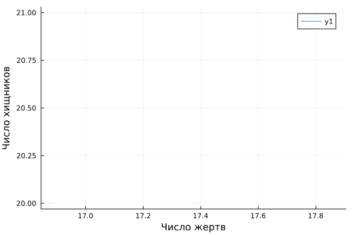

---
## Front matter
title: "Отчёт по лабораторной работе №5"
subtitle: "Вариант 67"
author: "Бабков Дмитрий Николаевич"

## I18n polyglossia
polyglossia-lang:
  name: russian
polyglossia-otherlangs:
  name: english
## I18n babel
babel-lang: russian
babel-otherlangs: english
## Fonts
mainfont: PT Serif
romanfont: PT Serif
sansfont: PT Sans
monofont: PT Mono
mainfontoptions: Ligatures=TeX
romanfontoptions: Ligatures=TeX
sansfontoptions: Ligatures=TeX,Scale=MatchLowercase
monofontoptions: Scale=MatchLowercase,Scale=0.9
## Biblatex
biblatex: true
biblio-style: "gost-numeric"
biblatexoptions:
  - parentracker=true
  - backend=biber
  - hyperref=auto
  - language=auto
  - autolang=other*
  - citestyle=gost-numeric
## Pandoc-crossref LaTeX customization
figureTitle: "Рис."
tableTitle: "Таблица"
listingTitle: "Листинг"
lofTitle: "Список иллюстраций"
lotTitle: "Список таблиц"
lolTitle: "Листинги"
## Misc options
indent: true
header-includes:
  - \usepackage{indentfirst}
  - \usepackage{float} # keep figures where there are in the text
  - \floatplacement{figure}{H} # keep figures where there are in the text
---

# Цель работы

Реализовать модель хищник-жертва

# Задание
Для модели хищник-жертва:
$$
\begin{equation*} 
 \begin{cases}
   \frac{dx}{dt} = -0.81x(t) + 0.048x(t)y(t)
   \\
   \frac{dy}{dt} = 0.76y(t) - 0.038x(t)y(t)
   
 \end{cases}
\end{equation*}
$$
построить график зависимости численности хищников от численности жертв, а также графики изменения численности хищников и численности жертв при следующих начальных условиях: $x_0 = 7, y_0 = 29$. Найти стационарное состояние системы.

$x$ - число хищников, $y$ - число жертв.

# Теоретическое введение

Простейшая модель взаимодействия двух видов типа «хищник — жертва» - модель Лотки-Вольтерры. Данная двувидовая модель основывается на следующих предположениях:
1. Численность популяции жертв $x$ и хищников $y$ зависят только от времени (модель не учитывает пространственное распределение популяции на занимаемой территории)
2. В отсутствии взаимодействия численность видов изменяется по модели Мальтуса, при этом число жертв увеличивается, а число хищников падает
3. Естественная смертность жертвы и естественная рождаемость хищника считаются несущественными
4. Эффект насыщения численности обеих популяций не учитывается
5. Скорость роста численности жертв уменьшается пропорционально численности хищников

$$
\begin{equation*} 
 \begin{cases}
   \frac{dy}{dt} = ax(t) + b(t)y(t)
   \\
   \frac{dx}{dt} = -cy(t) - dx(t)y(t)
   
 \end{cases}
\end{equation*}
$$

В этой модели $y$ – число жертв, $x$ - число хищников. Коэффициент $a$ описывает скорость естественного прироста числа жертв в отсутствие хищников, $с$ - естественное вымирание хищников, лишенных пищи в виде жертв. Вероятность взаимодействия жертвы и хищника считается пропорциональной как количеству жертв, так и числу самих хищников ($xy$). Каждый акт взаимодействия уменьшает популяцию жертв, но способствует увеличению популяции хищников (члены $-bxy$ и $dxy$ в правой части уравнения).

Стационарное состояние системы (положение равновесия, не зависящее от времени решение) будет в точке $x_0 = \frac{c}{d}, y_0 = \frac{a}{b}$. Если начальные значения задать в стационарном состоянии, то в любой момент времени численность популяции будет неизменной.

# Выполнение работы

Перед написанием кода, я нашёл стационарное состояние системы по формуле $y_0 = \frac{c}{d}, x_0 = \frac{a}{b}$. $c = 0.81$, $d = 0.048$, $a = 0.76$, $b = 0.038$, следовательно $x_0 = \frac{0.76}{0.038} = 20$, а $y_0 = \frac{0.81}{0.048} = 16.875$

## Julia

Открыв Pluto.jl я приступил к написанию кода. Сначала я подключил библиотеки Plots и DiffetentialEquations:
```
using Plots, DiffetentialEquations
```

Далее я ввёл данные, приведённые в условии задачи, а также временные рамки и изменение времени:

```
# Начальное число хищников и жертв
x_0 = 7.0
y_0 = 29.0
tspan = (0, 20)
dt = 0.01
```

После этого я задал функцию, являющуюся системой ОДУ, и решил её с помощью solve:

```
function ode_fn(du, u, p, t)
	x, y = u
	du[1] = -0.81 * x + 0.048 * x * y
	du[2] = 0.76 * y - 0.038 * x * y
end

prob = ODEProblem(ode_fn, [x_0, y_0], tspan)
sol = solve(prob, dtmax = dt)

diffX = [u[1] for u in sol.u]
diffY = [u[2] for u in sol.u]
diffT = [timestamp for timestamp in sol.t]
```

После чего вывел график зависимости численности хищников от численности жертв:

```
# Выводим на график изменение числа хищников от числа жертв

plt = plot(
	diffY,
	diffX,
	xlabel = "Число жертв",
	ylabel = "Число хищников"
)
```


И отдельный график изменения числа жертв и хищников по времени:

```
# Выводим на график изменение числа хищников и жертв от времени

plt2 = plot(
	diffT,
	diffY,
	label = "Количество хищников"
)

plot!(
	diffT,
	diffX,
	label = "Количество жертв"
)
```


Далее я подставил значения, полученные при вычислении стационарного состояния в качестве начальных значений, чтобы проверить, является ли эта точка - стационарным состоянием:



## OpenModelica

Открыв OpenModelica я задал переменные $x$ и $y$, начальные условия и систему ОДУ, по которой затем создал симуляцию:

```
model lab05
  Real x;
  Real y;
initial equation
  x = 7;
  y = 29;
equation
  der(x) = -0.81 * x + 0.048 * x * y;
  der(y) = 0.76 * y - 0.038 * x * y;
end lab05;
```


И вывел график изменения числа хищников от числа жертв, а также график изменения количества хищников и жертв от времени:


Далее я подставил значения, полученные при вычислении стационарного состояния в качестве начальных и снова провёл симуляцию, получив следующий график:


# Вывод

Я построил модель хищник-жертва на Julia и OpenModelica, изучил зависимость числа хищников от числа жертв, а также нашёл стационарное состояние системы.