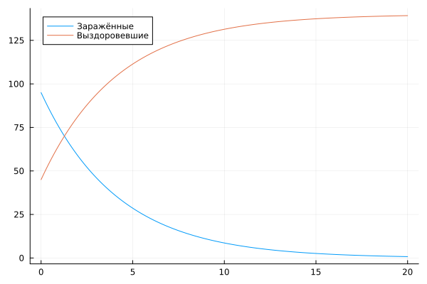
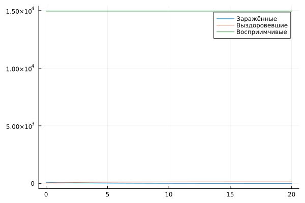
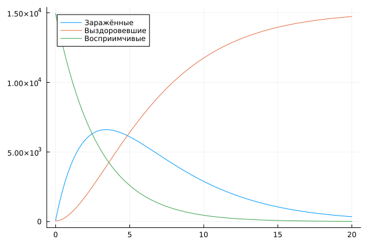
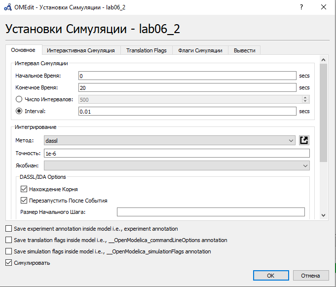
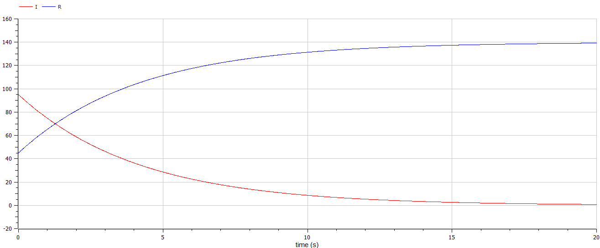
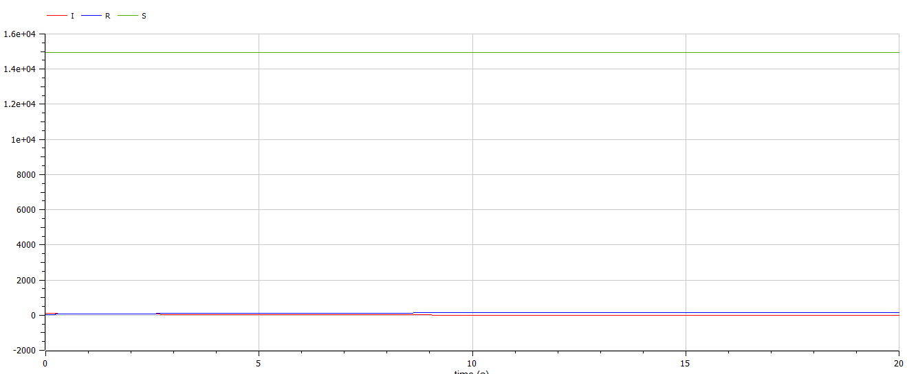
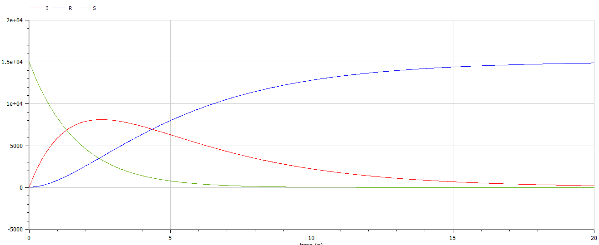

---
## Front matter
title: "Отчёт по лабораторной работе №6"
subtitle: "Вариант 67"
author: "Бабков Дмитрий Николаевич"

## I18n polyglossia
polyglossia-lang:
  name: russian
polyglossia-otherlangs:
  name: english
## I18n babel
babel-lang: russian
babel-otherlangs: english
## Fonts
mainfont: PT Serif
romanfont: PT Serif
sansfont: PT Sans
monofont: PT Mono
mainfontoptions: Ligatures=TeX
romanfontoptions: Ligatures=TeX
sansfontoptions: Ligatures=TeX,Scale=MatchLowercase
monofontoptions: Scale=MatchLowercase,Scale=0.9
## Biblatex
biblatex: true
biblio-style: "gost-numeric"
biblatexoptions:
  - parentracker=true
  - backend=biber
  - hyperref=auto
  - language=auto
  - autolang=other*
  - citestyle=gost-numeric
## Pandoc-crossref LaTeX customization
figureTitle: "Рис."
tableTitle: "Таблица"
listingTitle: "Листинг"
lofTitle: "Список иллюстраций"
lotTitle: "Список таблиц"
lolTitle: "Листинги"
## Misc options
indent: true
header-includes:
  - \usepackage{indentfirst}
  - \usepackage{float} # keep figures where there are in the text
  - \floatplacement{figure}{H} # keep figures where there are in the text
---

# Цель работы

Реализовать и проанализировать модель распространения эпидемии

# Задача

На одном острове вспыхнула эпидемия. Известно, что из всех проживающих на острове (N=15 089) в момент начала эпидемии (t=0) число заболевших людей (являющихся распространителями инфекции) $I(0)=95$, А число здоровых людей с иммунитетом к болезни $R(0)=45$. Таким образом, число людей восприимчивых к болезни, но пока здоровых, в начальный момент времени $S(0)=N-I(0)- R(0)$.

Необходимо построить графики изменения числа особей в каждой из трех групп и рассмотреть, как будет протекать эпидемия в случае:

1. Если $I(0) \le I^*$
2. Если $I(0) > I^*$

# Теоретическое введение

Рассмотрим простейшую модель эпидемии. Предположим, что некая популяция, состоящая из N особей, (считаем, что популяция изолирована) подразделяется на три группы. Первая группа - это восприимчивые к болезни, но пока здоровые особи, обозначим их через S(t). Вторая группа – это число инфицированных особей, которые также при этом являются распространителями инфекции, обозначим их I(t). А третья группа, обозначающаяся через R(t) – это
здоровые особи с иммунитетом к болезни.

До того, как число заболевших не превышает критического значения $I^*$, считаем, что все больные изолированы и не заражают здоровых. Когда $I(t)>I^*$, тогда инфицирование способны заражать восприимчивых к болезни особей.

Таким образом, скорость изменения числа S(t) меняется по следующему закону:

$$
\frac{dS}{dt}=
\begin{equation*} 
 \begin{cases}
   -\alpha S, если \ I(t) > I^*
   \\
   0, если \ I(t) \le I^*
 \end{cases}
\end{equation*}
$$

Поскольку каждая восприимчивая к болезни особь, которая, в конце концов, заболевает, сама становится инфекционной, то скорость изменения числа инфекционных особей представляет разность за единицу времени между заразившимися и теми, кто уже болеет и лечится, т.е.:

$$
\frac{dI}{dt}=
\begin{equation*} 
 \begin{cases}
   \alpha S - \beta I, если \ I(t) > I^*
   \\
   -\beta I, если \ I(t) \le I^*
 \end{cases}
\end{equation*}
$$

А скорость изменения выздоравливающих особей (при этом приобретающие иммунитет к болезни)

$$
\frac{dR}{dt} = \beta I
$$

Постоянные пропорциональности $\alpha$ и $\beta$, - это коэффициенты заболеваемости и выздоровления соответственно.

# Выполнение работы
## Julia

Открыв Pluto.jl я приступил к написанию кода. Сначала я подключил библиотеки Plots и DiffetentialEquations:

```
using Plots, DiffetentialEquations
```

Далее я ввёл начальные данные, представленные в условии задачи, коэффиценты $\alpha$ и $\beta$, а также временные рамки и интервал моделирования:

```
# Начальные условия

N = 15089
I0 = 95
R0 = 45
S0 = N - I0 - R0
tspan = (0, 20)
dt = 0.01
α = 0.35
β = 0.24
```

Далее я задал и решил систему дифференциальных для случая, когда $I(0) \le I^*$:

```
# Система ОДУ для I(0) <= I*

function ode_fn_1(du, u, p, t)
	S, I, R = u
	du[1] = 0
	du[2] = - β * I
	du[3] = β * I
end

prob1 = ODEProblem(ode_fn_1, [S0, I0, R0], tspan)

# Решение системы ОДУ

sol1 = solve(prob1, dtmax = dt)

diffS1 = [u[1] for u in sol1.u]
diffI1 = [u[2] for u in sol1.u]
diffR1 = [u[3] for u in sol1.u]
diffT1 = [timestamp for timestamp in sol1.t]
```

Следующим шагом я вывел изменение численности групп на график с помощью метода plot():

```
# График изменения численности групп

plt1 = plot(
	diffT1,
	diffI1,
	label = "Заражённые"
)

plot!(
	diffT1,
	diffR1,
	label = "Выздоровевшие"
)

plot!(
	diffT1,
	diffS1,
	label = "Восприимчивые"
)
```
График изменения количества заражённых и выздоровевших от времени без графика изменения числа восприимчивых:


График изменения количества заражённых во всех группах:


Для случая, где $I(0) > I^*$ решение аналогичное - меняется только формула в системе ОДУ:

```
# Система ОДУ для I(0) > I*

function ode_fn_2(du, u, p, t)
	S, I, R = u
	du[1] = - α * S
	du[2] = α * S - β * I
	du[3] = β * I
end

prob2 = ODEProblem(ode_fn_2, [S0, I0, R0], tspan)

# Решение системы ОДУ

sol2 = solve(prob2, dtmax = dt)

diffS2 = [u[1] for u in sol2.u]
diffI2 = [u[2] for u in sol2.u]
diffR2 = [u[3] for u in sol2.u]
diffT2 = [timestamp for timestamp in sol1.t]

# График изменения численности групп

plt2 = plot(
	diffT2,
	diffI2,
	label = "Заражённые"
)

plot!(
	diffT2,
	diffR2,
	label = "Выздоровевшие"
)

plot!(
	diffT2,
	diffS2,
	label = "Восприимчивые"
)
```

График изменения числа особей во всех группах от времени:



## OpenModelica

Открыв OpenModelica я задал константы $N$, $\alpha$ и $\beta$, а также переменные $S$, $I$ и $R$.

После этого я задал начальные условия и систему ОДУ для первого случая, по которой была построена симуляция:

```
model lab06_1
  Real N = 15089;
  Real S;
  Real I;
  Real R;
  Real beta = 0.24;
  Real alpha = 0.59;

initial equation
  I = 95;
  R = 45;
  S = N - I - R;

equation
  der(S) = 0;
  der(I) = - beta * I;
  der(R) = beta * I;

end lab06_1;
```

Задал установки симуляции (одинаковые для обоих случаев):



После этого вывел графики изменения групп $I$ и $R$:



После этого вывел вместе с ними график изменения группы $S$:



После этого я задал систему ОДУ для второго случая:

```
model lab06_2

  Real N = 15089;
  Real S;
  Real I;
  Real R;
  Real beta = 0.24;
  Real alpha = 0.59;

initial equation
  I = 95;
  R = 45;
  S = N - I - R;

equation
  der(S) = - alpha * S;
  der(I) = alpha * S - beta * I;
  der(R) = beta * I;

end lab06_2;
```

Построил симуляцию и вывел графики изменения групп $S$, $I$ и $R$:



# Вывод

Я построил графики изменения групп $S$, $I$ и $R$ для двух случаев. В первом случае количество зараженных не увеличивалось, из-за чего они в течение некоторого времени выздоровели, не увеличивая своего количества.

Во втором случае инфецированные имели возможность заражать здоровых, из-за чего каждый человек в популяции острова был заражён и в конечном итоге выздоровел.