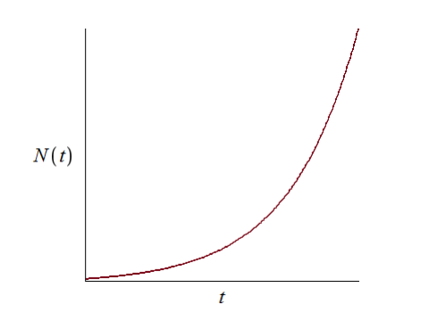

# Эффективность рекламы
## Выполнил Бабков Дмитрий Николаевич
Группа: НФИбд-01-20, №Студенческого билета: 1032201726

---

# Модель рекламы

Предположим, что торговыми учреждениями реализуется некоторая продукция, о которой в момент времени $t$ из числа потенциальных покупателей $N$ знает лишь $n$ покупателей. Для ускорения сбыта продукции запускается реклама по радио, телевидению и других средств массовой информации. После запуска рекламной кампании информация о продукции начнет распространяться среди потенциальных покупателей путем общения друг с другом. Таким образом, после запуска рекламных объявлений скорость изменения числа знающих о продукции людей пропорциональна как числу знающих о товаре покупателей, так и числу покупателей о нем не знающих

---

# Распространение рекламой

Модель рекламной кампании описывается следующими величинами. Считаем, что $\frac{dn}{dt}$ - скорость изменения со временем числа потребителей, узнавших о товаре и готовых его купить, $t$ - время, прошедшее с начала рекламной кампании, $n(t)$ - число уже информированных клиентов. Эта величина пропорциональна числу покупателей, еще не знающих о нем, это описывается следующим образом: $\alpha_1(t)(N - n(t))$, где $N$ - общее число потенциальных платежеспособных покупателей, $\alpha_1(t) > 0$ - характеризует интенсивность рекламной кампании (зависит от затрат на рекламу в данный момент времени). 

---

# Распространение среди потребителей

Помимо этого, узнавшие о товаре потребители также распространяют полученную информацию среди потенциальных покупателей, не знающих о нем (в этом случае работает т.н. сарафанное радио). Этот вклад в рекламу описывается величиной $\alpha_2(t)n(t)(N - n(t))$, эта величина увеличивается с увеличением потребителей узнавших о товаре. Математическая модель распространения рекламы описывается уравнением:

$$
\frac{dn}{dt} = (\alpha_1(t) + \alpha_2(t)n(t))(N-n(t))
$$

---

# Типы модели

При $\alpha_1 \gg \alpha_2$ получается модель типа модели Мальтуса, решение которой имеет следующий вид

---

В обратном случае, при $\alpha_1 \ll \alpha_2$, получаем уравнение логистической кривой:

---

# Спасибо за внимание