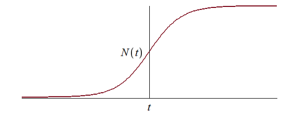
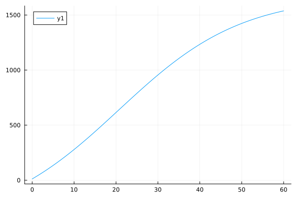
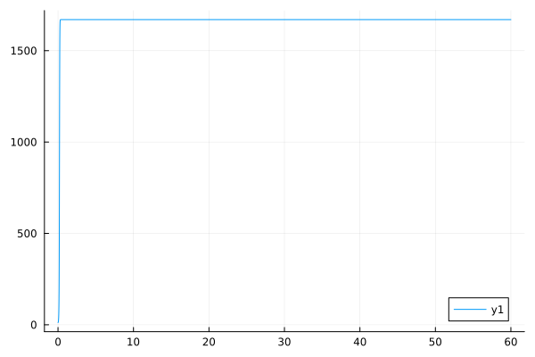
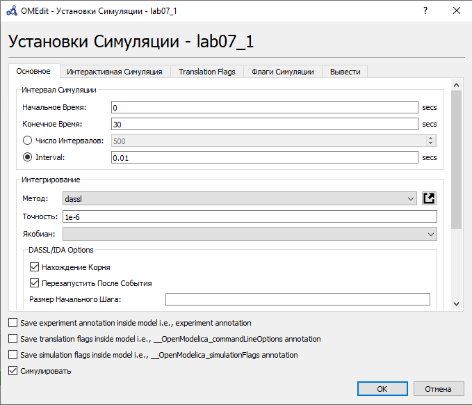
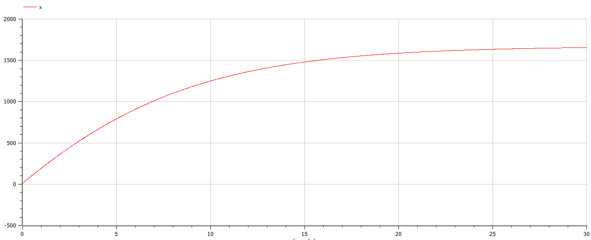
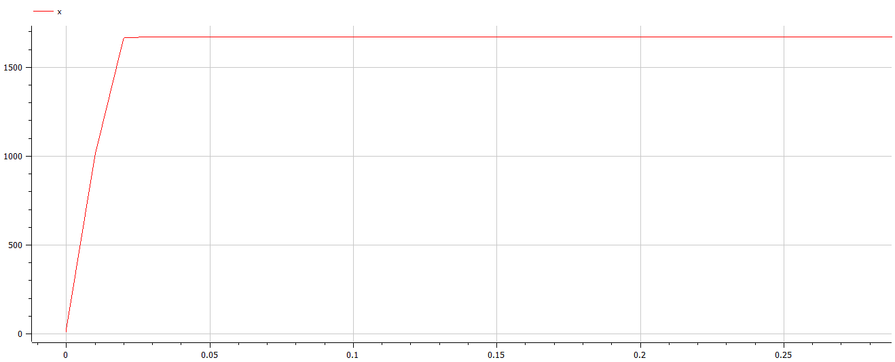
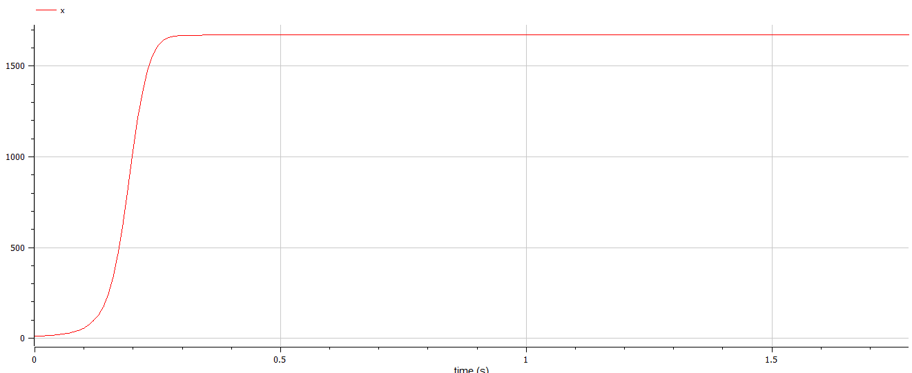

---
## Front matter
title: "Отчёт по лабораторной работе №7"
subtitle: "Вариант 67"
author: "Бабков Дмитрий Николаевич"

## I18n polyglossia
polyglossia-lang:
  name: russian
polyglossia-otherlangs:
  name: english
## I18n babel
babel-lang: russian
babel-otherlangs: english
## Fonts
mainfont: PT Serif
romanfont: PT Serif
sansfont: PT Sans
monofont: PT Mono
mainfontoptions: Ligatures=TeX
romanfontoptions: Ligatures=TeX
sansfontoptions: Ligatures=TeX,Scale=MatchLowercase
monofontoptions: Scale=MatchLowercase,Scale=0.9
## Biblatex
biblatex: true
biblio-style: "gost-numeric"
biblatexoptions:
  - parentracker=true
  - backend=biber
  - hyperref=auto
  - language=auto
  - autolang=other*
  - citestyle=gost-numeric
## Pandoc-crossref LaTeX customization
figureTitle: "Рис."
tableTitle: "Таблица"
listingTitle: "Листинг"
lofTitle: "Список иллюстраций"
lotTitle: "Список таблиц"
lolTitle: "Листинги"
## Misc options
indent: true
header-includes:
  - \usepackage{indentfirst}
  - \usepackage{float} # keep figures where there are in the text
  - \floatplacement{figure}{H} # keep figures where there are in the text
---

# Цель работы

Реализовать и проанализировать модель эффективности рекламы

# Задача

Построить график распространения рекламы, математическая модель которой описывается следующим уравнением:
1. $\frac{dn}{dt} = (0.133 + 0.000033n(t))(N - n(t))$
2. $\frac{dn}{dt} = (0.0000132 + 0.32n(t))(N - n(t))$
3. $\frac{dn}{dt} = (0.8t + 0.15sin(t)n(t))(N - n(t))$

При этом объем аудитории $N = 1670$, в начальный момент о товаре знает 12 человек. Для случая 2 определить в какой момент времени скорость распространения рекламы будет иметь максимальное значение.

# Теоретическое введение

Предположим, что торговыми учреждениями реализуется некоторая продукция, о которой в момент времени $t$ из числа потенциальных покупателей $N$ знает лишь $n$ покупателей. Для ускорения сбыта продукции запускается реклама по радио, телевидению и других средств массовой информации. После запуска рекламной кампании информация о продукции начнет распространяться среди потенциальных покупателей путем общения друг с другом. Таким образом, после запуска рекламных объявлений скорость изменения числа знающих о продукции людей пропорциональна как числу знающих о товаре покупателей, так и числу покупателей о нем не знающих

Модель рекламной кампании описывается следующими величинами. Считаем, что $\frac{dn}{dt}$ - скорость изменения со временем числа потребителей, узнавших о товаре и готовых его купить, $t$ - время, прошедшее с начала рекламной кампании, $n(t)$ - число уже информированных клиентов. Эта величина пропорциональна числу покупателей, еще не знающих о нем, это описывается следующим образом: $\alpha_1(t)(N - n(t))$, где $N$ - общее число потенциальных платежеспособных покупателей, $\alpha_1(t) > 0$ - характеризует интенсивность рекламной кампании (зависит от затрат на рекламу в данный момент времени). 

Помимо этого, узнавшие о товаре потребители также распространяют полученную информацию среди потенциальных покупателей, не знающих о нем (в этом случае работает т.н. сарафанное радио). Этот вклад в рекламу описывается величиной $\alpha_2(t)n(t)(N - n(t))$, эта величина увеличивается с увеличением потребителей узнавших о товаре. Математическая модель распространения рекламы описывается уравнением:

$$
\frac{dn}{dt} = (\alpha_1(t) + \alpha_2(t)n(t))(N-n(t))
$$

При $\alpha_1 \gg \alpha_2$ получается модель типа модели Мальтуса, решение которой имеет следующий вид


В обратном случае, при $\alpha_1 \ll \alpha_2$, получаем уравнение логистической кривой:



# Выполнение работы

## Julia

Открыв Pluto.jl я приступил к написанию кода. Сначала я подключил библиотеки Plots и DiffetentialEquations:

```
using Plots, DiffetentialEquations
```

Далее я ввёл начальные данные, представленные в условии задачи, коэффиценты $\alpha_1$ и $\alpha_2$ для всех трёх случаев, а также временные рамки и интервал моделирования:

```
# Начальные условия

N = 1670
n0 = 12
timespan = (0, 30)
dt = 0.01

# Для первого случая

α1_1 = 0.013
α2_1 =  0.000033

# Для второго случая

α1_2 = 0.0000132
α2_2 =  0.32

# Для третьего случая

α1_3 = 0.8
α2_3 =  0.15
```

После этого я задал и решил ОДУ для каждого из случаев:

```
# ОДУ

# Первый случай

ode_fn1(x, p, t) = (α1_1 + α2_1 * x) * (N - x)
prob1 = ODEProblem(ode_fn1, n0, timespan)
sol1 = solve(prob1, dtmax = dt)

diffX1 = [u[1] for u in sol1.u]
diffT1 = [timestamp for timestamp in sol1.t]

# Второй случай

ode_fn2(x, p, t) = (α1_2 + α2_2 * x) * (N - x)
prob2 = ODEProblem(ode_fn2, n0, timespan)
sol2 = solve(prob2, dtmax = dt)

diffX2 = [u[1] for u in sol2.u]
diffT2 = [timestamp for timestamp in sol2.t]

# Третий случай

ode_fn3(x, p, t) = (α1_3 * t + α2_3 * sin(t) * x) * (N - x)
prob3 = ODEProblem(ode_fn3, n0, timespan)
sol3 = solve(prob3, dtmax = dt)

diffX3 = [u[1] for u in sol3.u]
diffT3 = [timestamp for timestamp in sol3.t]
```

В конце я вывел графики изменения x(t) для всех трёх случаев с помощью plot:

```
# График первого случая

plt1 = plot(
	diffT1,
	diffX1
)

# График второго случая

plt2 = plot(
	diffT2,
	diffX2
)

# График третьего случая

plt3 = plot(
	diffT3,
	diffX3
)
```

Получившиеся графики представлены на изображениях ниже:





## OpenModelica

Открыв OpenModelica, я создал три файла модели для - каждого из случаев. Далее, задав начальные условия и коэффициенты $\alpha_1$ и $\alpha_2$, я ввёл уравнение математической модели, описанное в задании, для каждого из случаев. Во втором случае с помощью метода if нашёл, в какой момент времени скорость изменения была максимальной. Наибольшее изменение в количестве заинтересованных покупателей было в момент времени с 0.00 по 0.01:

```
model lab07_1
  
  
Real N = 1670;
  Real x;
  Real alpha1 = 0.113;
  Real alpha2 = 0.000033;
initial equation
  
  x = 12;

equation

  der(x) = (alpha1 + alpha2 * x) * (N - x);

end lab07_1;
```

```
model lab07_2
  
  Real N = 1670;
  Real x;
  Real alpha1 = 0.0000132;
  Real alpha2 =  0.32;
  
  Real maxDiff = 0;
  Real maxDiffTime = 0;

initial equation
  
  x = 12;

equation

  der(x) = (alpha1 + alpha2 * x) * (N - x);
  
  if der(x) > maxDiff then
    maxDiff = der(x);
    maxDiffTime = time;
  end if;
  
end lab07_2;
```

```
model lab07_3
  
  Real N = 1670;
  Real x;
  Real alpha1 = 0.8;
  Real alpha2 = 0.15;

initial equation
  
  x = 12;

equation

  der(x) = (alpha1 * time + alpha2 * sin(time) * x) * (N - x);
  
end lab07_3;
```

Далее я задал установки моделирования и смоделировал все три случая:



Графики изменения (второй и третий приближены для лучшей читаемости):





# Вывод

В ходе выполнения лабораторной работы были построены графики изменения числа заинтересованных покупателей в ходе рекламной кампании на языках Julia и OpenModelica для трёх случаев. Во втором случае было найдено, в какой момент времени изменение числа заинтересованных покупателей было максимальным.