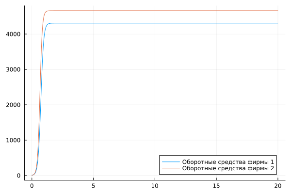
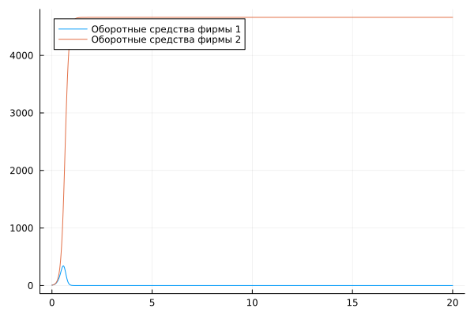
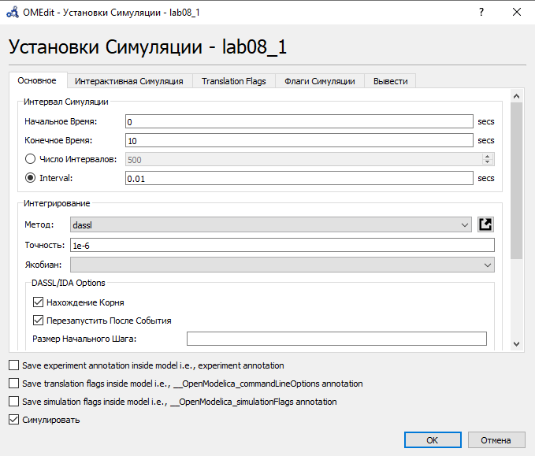
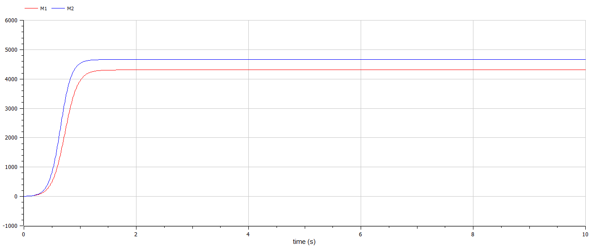
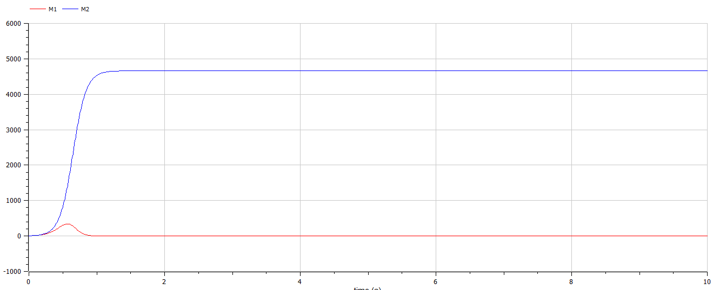

---
## Front matter
title: "Отчёт по лабораторной работе №8"
subtitle: "Вариант 67"
author: "Бабков Дмитрий Николаевич"

## I18n polyglossia
polyglossia-lang:
  name: russian
polyglossia-otherlangs:
  name: english
## I18n babel
babel-lang: russian
babel-otherlangs: english
## Fonts
mainfont: PT Serif
romanfont: PT Serif
sansfont: PT Sans
monofont: PT Mono
mainfontoptions: Ligatures=TeX
romanfontoptions: Ligatures=TeX
sansfontoptions: Ligatures=TeX,Scale=MatchLowercase
monofontoptions: Scale=MatchLowercase,Scale=0.9
## Biblatex
biblatex: true
biblio-style: "gost-numeric"
biblatexoptions:
  - parentracker=true
  - backend=biber
  - hyperref=auto
  - language=auto
  - autolang=other*
  - citestyle=gost-numeric
## Pandoc-crossref LaTeX customization
figureTitle: "Рис."
tableTitle: "Таблица"
listingTitle: "Листинг"
lofTitle: "Список иллюстраций"
lotTitle: "Список таблиц"
lolTitle: "Листинги"
## Misc options
indent: true
header-includes:
  - \usepackage{indentfirst}
  - \usepackage{float} # keep figures where there are in the text
  - \floatplacement{figure}{H} # keep figures where there are in the text
---

# Цель работы

Построить модель конкуренции двух фирм

# Задача

Случай 1. Рассмотрим две фирмы, производящие взаимозаменяемые товары одинакового качества и находящиеся в одной рыночной нише. Считаем, что в рамках нашей модели конкурентная борьба ведётся только рыночными методами. То есть, конкуренты могут влиять на противника путем изменения параметров своего производства: себестоимость, время цикла, но не могут прямо вмешиваться в ситуацию на рынке («назначать» цену или влиять на потребителей каким-либо иным способом.) Будем считать, что постоянные издержки пренебрежимо малы, и в модели учитывать не будем. В этом случае динамика изменения объемов продаж фирмы 1 и фирмы 2 описывается следующей системой уравнений:

$$
\frac{dM_1}{d\theta} = M_1 - \frac{b}{c_1}M1M2-\frac{a_1}{c_1}M_1^2
$$
$$
\frac{dM_2}{d\theta} = \frac{c_2}{c_1}M_2 - \frac{b}{c_1}M1M2-\frac{a_2}{c_1}M_2^2
$$

где $a_1 = \frac{p_{cr}}{\tau_1^2\overline{p}_1^2Nq}, a_2 = \frac{p_{cr}}{\tau_2^2\overline{p}_2^2Nq}, b=\frac{p_{cr}}{\tau_1^2\overline{p}_1^2\tau_2^2\overline{p}_2^2Nq}, c_1 = \frac{p_{cr}-\overline{p}_1}{\tau_1\overline{p}_1}, c_2 = \frac{p_{cr}-\overline{p}_2}{\tau_2\overline{p}_2}$

Также введена нормировка $t = c_1\theta$

Случай 2. Рассмотрим модель, когда, помимо экономического фактора влияния (изменение себестоимости, производственного цикла, использование кредита и т.п.), используются еще и социально-психологические факторы – формирование общественного предпочтения одного товара другому, не зависимо от их качества и цены. В этом случае взаимодействие двух фирм будет зависеть друг от друга, соответственно коэффициент перед $M_1M_2$ будет отличаться. Пусть в рамках рассматриваемой модели динамика изменения объемов продаж фирмы 1 и фирмы 2 описывается следующей системой уравнений:

$$
\frac{dM_1}{d\theta} = M_1 - \frac{b}{c_1}M1M2-\frac{a_1}{c_1}M_1^2
$$
$$
\frac{dM_2}{d\theta} = \frac{c_2}{c_1}M_2 - (\frac{b}{c_1}+0.00067)M1M2-\frac{a_2}{c_1}M_2^2
$$

Для обоих случаев рассмотрим задачу со следующими начальными условиями и параметрами:

$M_0^1 = 6.8, M_0^2 = 6, p_{cr} = 35, N = 31, q = 1, \tau_1 = 18, \tau_2 = 23, \overline{p}_1 = 11.5, \overline{p}_2 = 8.7$.

Необходимо построить графики изменения оборотных средств фирм 1 и 2 для обоих случаев.

# Теоретическое введение

Для построения модели конкуренции хотя бы двух фирм необходимо рассмотреть модель одной фирмы. Вначале рассмотрим модель фирмы, производящей продукт долговременного пользования, когда цена его определяется балансом спроса и предложения. Примем, что этот продукт занимает определенную нишу рынка и конкуренты в ней отсутствуют.

Обозначим:

N – число потребителей производимого продукта.

S – доходы потребителей данного продукта. Считаем, что доходы всех потребителей одинаковы. Это предположение справедливо, если речь идет об одной рыночной нише, т.е. производимый продукт ориентирован на определенный слой населения.

M – оборотные средства предприятия

τ – длительность производственного цикла

p – рыночная цена товара

p̃ – себестоимость продукта, то есть переменные издержки на производство единицы продукции.

δ – доля оборотных средств, идущая на покрытие переменных издержек.

κ – постоянные издержки, которые не зависят от количества выпускаемой продукции.

Q(S/p) – функция спроса, зависящая от отношения дохода S к цене p. Она равна количеству продукта, потребляемого одним потребителем в единицу времени.

Функцию спроса товаров долговременного использования часто представляют в простейшей форме:

$$
Q = q-k\frac{p}{S}=q(1-\frac{p}{p_{cr}}) \ \ (1)
$$

где $q$ – максимальная потребность одного человека в продукте в единицу времени. Эта функция падает с ростом цены и при $p = p_{cr}$ (критическая стоимость продукта) потребители отказываются от приобретения товара. Величина $p_{cr} = Sq/k$. Параметр k – мера эластичности функции спроса по цене. Таким образом, функция спроса в форме (1) является пороговой (то есть, Q(S/p) = 0 при p ≥ pcr) и обладает свойствами насыщения

Уравнения динамики оборотных средств можно записать в виде

$$
\frac{dM}{dt}=-\frac{M\delta}{\tau} + NQp - k = -\frac{M\delta}{\tau}+NQ(1-\frac{p}{p_{cr}})p-k
$$

Равновесное значение цены $p$ равно 

$$
p = p_{cr}(1-\frac{M\delta}{\tau\overline{p}Nq})
$$

Из-за чего уравнение динамики обротных средств принимает следующий вид:

$$
\frac{dM}{dt} = M\frac{\delta}{\tau}(\frac{p_{cr}}{\overline{p}}-1)-M^2(\frac{\delta}{\tau\overline{p}})^2\frac{p_{cr}}{Nq}-k
$$

# Выполнение работы

## Julia

Открыв Pluto.jl я приступил к написанию кода. Сначала я подключил библиотеки Plots и DiffetentialEquations:

```
using Plots, DiffetentialEquations
```

Далее я ввёл начальные данные, представленные в условии задачи, коэффиценты, временные рамки и интервал моделирования.

```
# Начальные условия

M_0_1 = 6.8
M_0_2 = 6

p_cr = 35
N = 31
q = 1
τ1 = 18
τ2 = 23
p_1 = 11.5
p_2 = 8.7

a1 = p_cr / (τ1^2 * p_1^2 * N * q)
a2 = p_cr / (τ2^2 * p_2^2 * N * q)
b = p_cr / (τ1^2 * p_1^2 * τ2^2 * p_2^2 * N * q)
c1 = (p_cr - p_1) / (τ1 * p_1)
c2 = (p_cr - p_2) / (τ2 * p_2)

timespan = (0, 20)
dt = 0.01
```

Далее я задал и решил систему ОДУ для обоих случаев, предварительно выразив $\theta$ через $t$, приведя тем самым $\frac{dM}{d\theta}$ к $\frac{dM}{dt}$:

```
# Система ОДУ:
# Первый случай:

function ode_fn_1(du, u, p, t)
	M_1, M_2 = u
	du[1] = (M_1/c1) - (b/c1^2) * M_1 * M_2 - (a1/c1^2) * M_1^2
	du[2] = ((c2 * M_2) / c1^2) - (b/c1^2) * M_1 * M_2 - (a2/c1^2) * M_2^2
end

prob1 = ODEProblem(ode_fn_1, [M_0_1, M_0_2], timespan)

# Решение системы ОДУ

sol1 = solve(prob1, dtmax = dt)

diffM1_1 = [u[1] for u in sol1.u]
diffM2_1 = [u[2] for u in sol1.u]
diffT1 = [timestamp for timestamp in sol1.t]

# Второй случай:

function ode_fn_2(du, u, p, t)
	M_1, M_2 = u
	du[1] = (M_1/c1) - (b/c1 + 0.00067) * M_1 * M_2 / c1 - (a1/c1^2) * M_1^2
	du[2] = ((c2 * M_2) / c1^2) - (b/c1^2) * M_1 * M_2 - (a2/c1^2) * M_2^2
end

prob2 = ODEProblem(ode_fn_2, [M_0_1, M_0_2], timespan)

# Решение системы ОДУ

sol2 = solve(prob2, dtmax = dt)

diffM1_2 = [u[1] for u in sol2.u]
diffM2_2 = [u[2] for u in sol2.u]
diffT2 = [timestamp for timestamp in sol2.t]
```

Далее, использовав plot, я построил графики изменения для обоих случаев:

```
# Построение графиков M1 и M2:

# Первый случай

plt1 = plot(
	diffT1,
	diffM1_1,
	label = "Оборотные средства фирмы 1"
)

plot!(
	diffT1,
	diffM2_1,
	label = "Оборотные средства фирмы 2"
)

# Второй случай

plt2 = plot(
	diffT2,
	diffM1_2,
	label = "Оборотные средства фирмы 1"
)

plot!(
	diffT2,
	diffM2_2,
	label = "Оборотные средства фирмы 2"
)
```





## OpenModelica

Открыв OpenModelica, я создал два файла модели - по одному на каждый случай. Далее, задав начальные условия и коэффициенты, я ввёл уравнение математической модели, описанное в задании, для каждого из случаев.

Первый случай:

```
model lab08_1
  
  Real M1;
  Real M2;
  Real p_cr = 35;
  Real N = 31;
  Real q = 1;
  Real tau1 = 18;
  Real tau2 = 23;
  Real p1 = 11.5;
  Real p2 = 8.7;
  Real a1 = p_cr / (tau1^2 * p1^2 * N * q);
  Real a2 = p_cr / (tau2^2 * p2^2 * N * q);
  Real b = p_cr / (tau1^2 * p1^2 * tau2^2 * p2^2 * N * q);
  Real c1 = (p_cr - p1) / (tau1 * p1);
  Real c2 = (p_cr - p2) / (tau2 * p2);
  
initial equation
  
  M1 = 6.8;
  M2 = 6;
  
equation

  der(M1) = (M1/c1) - (b/c1^2) * M1 * M2 - (a1/c1^2) * M1^2;
  der(M2) = ((c2 * M2) / c1^2) - (b/c1^2) * M1 * M2 - (a2/c1^2) * M2^2;

end lab08_1;
```

Второй случай:

```
model lab08_2

  Real M1;
  Real M2;
  Real p_cr = 35;
  Real N = 31;
  Real q = 1;
  Real tau1 = 18;
  Real tau2 = 23;
  Real p1 = 11.5;
  Real p2 = 8.7;
  Real a1 = p_cr / (tau1^2 * p1^2 * N * q);
  Real a2 = p_cr / (tau2^2 * p2^2 * N * q);
  Real b = p_cr / (tau1^2 * p1^2 * tau2^2 * p2^2 * N * q);
  Real c1 = (p_cr - p1) / (tau1 * p1);
  Real c2 = (p_cr - p2) / (tau2 * p2);
  
initial equation
  
  M1 = 6.8;
  M2 = 6;
  
equation

  der(M1) = (M1/c1) - (b/c1 + 0.00067) * M1 * M2 / c1 - (a1/c1^2) * M1^2;
  der(M2) = ((c2 * M2) / c1^2) - (b/c1^2) * M1 * M2 - (a2/c1^2) * M2^2;
  
end lab08_2;
```

Далее я смоделировал их со следующими установками:


И отобразил графики изменения оборотный средств:





# Вывод

В ходе выполнения лабораторной работы была построена модель изменения оборотных средств для двух случаев на языках Julia и OpenModelica