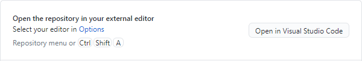
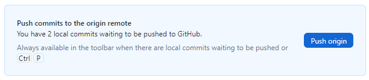

# Презентация по лабораторной работе №1
## Выполнил Бабков Дмитрий Николаевич

---

# Создание репозитория
В приложение GitHub Desktop создаётся репозиторий work, который будет загружен на Гитхаб

---

# Редактирование репозитория
Открывается Visual Studio Code, в котором создаётся рабочее пространство по шаблону на ТУИС 

---

# Commit и Push

После всех необходимых изменений, их нужно подтвердить и отправить на Гитхаб. Делается это в приложении GitHub Desktop с помощью следующих действий:

---

# Проверка

После выполнения действий Commit и Push, можно зайти на Github.com и проверить корректность выполнения:

---

# Вывод

С помощью приложений GitHub Desktop и Visual Studio Code можно с лёгкостью создавать и изменять репозитории на Гитхаб

---

# Спасибо за внимание