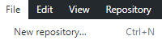
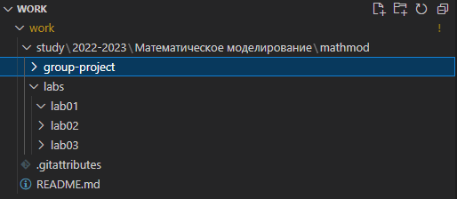

---
## Front matter
title: "Отчёт по лабораторной работе №1"
author: "Бабков Дмитрий Николаевич"

polyglossia-otherlangs:
  name: english
## I18n babel
babel-lang: russian
babel-otherlangs: english
## Fonts
mainfont: PT Serif
romanfont: PT Serif
sansfont: PT Sans
monofont: PT Mono
mainfontoptions: Ligatures=TeX
romanfontoptions: Ligatures=TeX
sansfontoptions: Ligatures=TeX,Scale=MatchLowercase
monofontoptions: Scale=MatchLowercase,Scale=0.9
## Biblatex
biblatex: true
biblio-style: "gost-numeric"
biblatexoptions:
  - parentracker=true
  - backend=biber
  - hyperref=auto
  - language=auto
  - autolang=other*
  - citestyle=gost-numeric
## Pandoc-crossref LaTeX customization
figureTitle: "Рис."
tableTitle: "Таблица"
listingTitle: "Листинг"
lofTitle: "Список иллюстраций"
lotTitle: "Список таблиц"
lolTitle: "Листинги"
## Misc options
indent: true
header-includes:
  - \usepackage{indentfirst}
  - \usepackage{float} # keep figures where there are in the text
  - \floatplacement{figure}{H} # keep figures where there are in the text
---

# Цель работы
Вспомнить методы работы с Markdown и GitHub

# Задание
Сделать репозиторий для лабораторных работ на Github, написать отчёт в Markdown

# Теоретическое введение
Для выполнения лабораторной работы необходимо зарегистрироваться на сайте Github.com, с помощью Visual Studio Code и приложения GitHub Desktop создать репозиторий, сделать необходимые по требованиям папки для разных заданий по данному предмету.

# Выполнение лабораторной работы
Будучи зарегистрированным на сайте Github.com и скачав приложение GitHub Desktop, я создал на диске D репозиторий под названием work

После этого я открыл репозиторий с помощью Visual Studio Code:

Открыв репозиторий, я создал необходимые по шаблону папки, и создал файл report с расширением md, в котором начал писать отчёт по проделанной работе:

После всего этого я сделал Commit и Push изменений на Гитхаб в приложении GitHub Desktop:

И после всех этих действий, файл report и остальные папки появились в репозитории work на GitHub:

# Выводы
В ходе лабораторной работы был создан репозиторий на Github и отчёт о выполнении лабораторной работы в Markdown