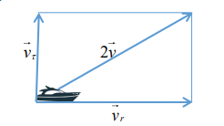
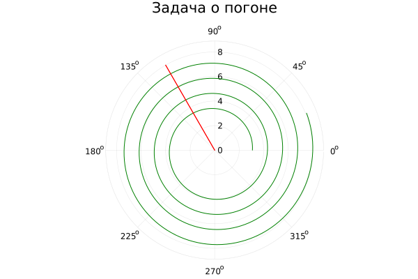
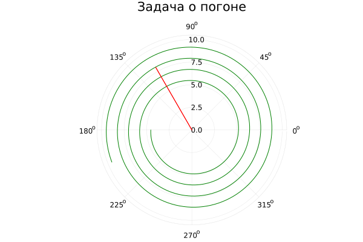

# Лабораторная работа №2
## Выполнил Бабков Дмитрий Николаевич
### № студ. билета: 1032201726, Группа: НФИбд-01-20

---

# Задача о погоне

На море в тумане катер береговой охраны преследует лодку браконьеров. Через определенный промежуток времени туман рассеивается, и лодка обнаруживается на расстоянии k км от катера. Затем лодка снова скрывается в тумане и уходит прямолинейно в неизвестном направлении. Известно, что скорость катера в 2 раза больше скорости браконьерской лодки. Необходимо определить по какой траектории необходимо двигаться катеру, чтоб нагнать лодку

---

# Постановка задачи
- Принимаем за $t_0$, $x_л0$ - место нахождения лодки браконьеров в момент обнаружения, $x_к0 = k$ - место нахождения катера береговой охраны относительно лодки браконьеров в момент обнаружения.
- Введем полярные координаты. Считаем, что полюс - это точка обнаружения лодки браконьеров $x_л0 (\theta = x_л0 = 0)$, а полярная ось $r$ проходит через точку нахождения катера береговой охраны
   
---

# Постановка задачи
- Траектория катера должна быть такой, чтобы и катер, и лодка все время были на одном расстоянии от полюса $\theta$, только в этом случае траектория катера пересечется с траекторией лодки. Поэтому для начала катер береговой охраны должен двигаться некоторое время прямолинейно, пока не окажется на том же расстоянии от полюса, что и лодка браконьеров. После этого катер береговой охраны должен двигаться вокруг полюса удаляясь от него с той же скоростью, что и лодка браконьеров.

---

# Постановка задачи 

- Чтобы найти расстояние $x$ (расстояние после которого катер начнет двигаться вокруг полюса), необходимо составить простое уравнение. Пусть через время $t$ катер и лодка окажутся на одном расстоянии $x$ от полюса. За это время лодка пройдет $x$, а катер $k-x$ или $k + x$, в зависимости от начального положения катера относительно полюса). Время, за которое они пройдут это расстояние, вычисляется как $x/v$ или $k - x / 2v$ (во втором
случае $x + k / 2v$). Так как время одно и то же, то эти величины одинаковы.

---

# Постановка задачи 

- После того, как катер береговой охраны окажется на одном расстоянии от полюса, что и лодка, он должен сменить прямолинейную траекторию и начать двигаться вокруг полюса удаляясь от него со скоростью лодки $v$. Для этого скорость катера раскладываем на две составляющие: $v_r$ - радиальная скорость и $v_\tau$ - тангенциальная скорость. $v_r = \frac{dr}{dt}$. Нам нужно, чтобы эта скорость была равна скорости лодки, поэтому полагаем, что $\frac{dr}{dt} = v$. Тангенциальная скорость равна произведению угловой скорости $\frac{d\theta}{dt}$ на радиус $r$, $v_\tau = r\frac{d\theta}{dt}$.

---

# Постановка задачи 

Решение исходной задачи сводится к решению системы из двух
дифференциальных уравнений

$$
\begin{equation*} 
 \begin{cases}
   \frac{dr}{dt} = v
   \\
   r\frac{d\theta}{dt} = \sqrt{3}v
   
 \end{cases}
\end{equation*}
$$

с начальными условиями 
$$
\begin{equation*}
    \begin{cases}

    \theta_0 = 0 \\ r_0 = x_1

    \end{cases}    
\end{equation*}
$$
или
$$
\begin{equation*}
    \begin{cases}

    \theta_0 = -\pi \\ r_0 = x_2

    \end{cases}    
\end{equation*}
$$

---

# Постановка задачи

Исключая из полученной системы производную по t, можно перейти к
следующему уравнению:
$$\frac{dr}{d\theta}=\frac{r}{\sqrt{3}}$$
Начальные условия остаются прежними. Решив это уравнение, мы получим траекторию движения катера в полярных координатах.

---

# Результат выполнения

В результате выполнения работы при начальных значениях $k = 19.1, v_л/v_к = 5.2$ получились следующие траектории в двух случаях:

---

# Результат выполнения

--- 

# Спасибо за внимание