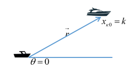
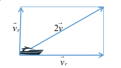
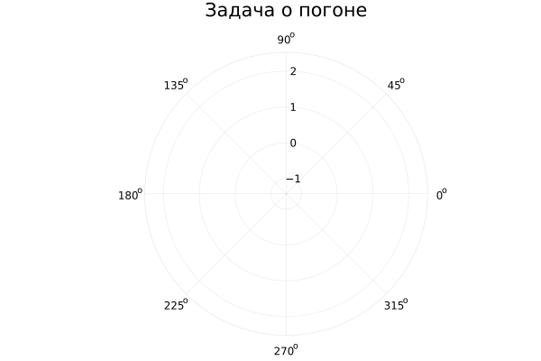
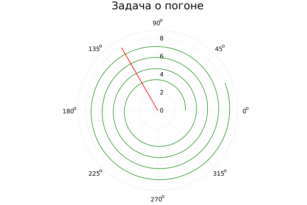
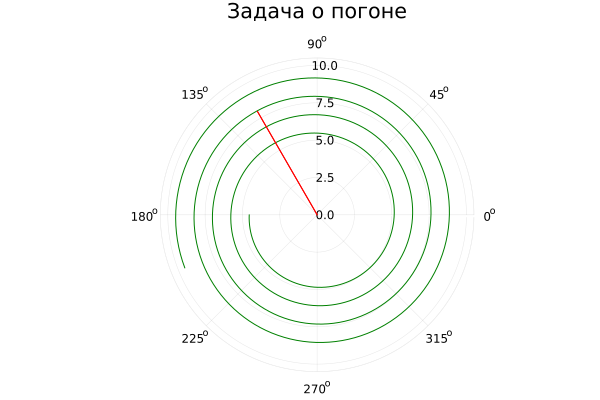

---
## Front matter
title: "Отчёт по лабораторной работе №2"
subtitle: "Вариант 67"
author: "Бабков Дмитрий Николаевич"

polyglossia-otherlangs:
  name: english
## I18n babel
babel-lang: russian
babel-otherlangs: english
## Fonts
mainfont: PT Serif
romanfont: PT Serif
sansfont: PT Sans
monofont: PT Mono
mainfontoptions: Ligatures=TeX
romanfontoptions: Ligatures=TeX
sansfontoptions: Ligatures=TeX,Scale=MatchLowercase
monofontoptions: Scale=MatchLowercase,Scale=0.9
## Biblatex
biblatex: true
biblio-style: "gost-numeric"
biblatexoptions:
  - parentracker=true
  - backend=biber
  - hyperref=auto
  - language=auto
  - autolang=other*
  - citestyle=gost-numeric
## Pandoc-crossref LaTeX customization
figureTitle: "Рис."
tableTitle: "Таблица"
listingTitle: "Листинг"
lofTitle: "Список иллюстраций"
lotTitle: "Список таблиц"
lolTitle: "Листинги"
## Misc options
indent: true
header-includes:
  - \usepackage{indentfirst}
  - \usepackage{float} # keep figures where there are in the text
  - \floatplacement{figure}{H} # keep figures where there are in the text
---

# Цель работы

Решить задачу о погоне

# Задание

На море в тумане катер береговой охраны преследует лодку браконьеров.
Через определенный промежуток времени туман рассеивается, и лодка
обнаруживается на расстоянии 19,1 км от катера. Затем лодка снова скрывается в
тумане и уходит прямолинейно в неизвестном направлении. Известно, что скорость
катера в 5,2 раза больше скорости браконьерской лодки.
1. Запишите уравнение, описывающее движение катера, с начальными
условиями для двух случаев (в зависимости от расположения катера
относительно лодки в начальный момент времени).
2. Постройте траекторию движения катера и лодки для двух случаев.
3. Найдите точку пересечения траектории катера и лодки 

# Теоретическое введение

1. Принимает за $t_0$, $x_л0$ - место нахождения лодки браконьеров в момент обнаружения, $x_к0 = k$ - место нахождения катера береговой охраны относительно лодки браконьеров в момент обнаружения.
2. Введем полярные координаты. Считаем, что полюс - это точка обнаружения лодки браконьеров $x_л0 (\theta = x_л0 = 0)$, а полярная ось $r$ проходит через точку нахождения катера береговой охраны
   
3. Траектория катера должна быть такой, чтобы и катер, и лодка все время были на одном расстоянии от полюса $\theta$, только в этом случае траектория катера пересечется с траекторией лодки. Поэтому для начала катер береговой охраны должен двигаться некоторое время прямолинейно, пока не окажется на том же расстоянии от полюса, что и лодка браконьеров. После этого катер береговой охраны должен двигаться вокруг полюса удаляясь от него с той же скоростью, что и лодка браконьеров.
4. Чтобы найти расстояние $x$ (расстояние после которого катер начнет двигаться вокруг полюса), необходимо составить простое уравнение. Пусть через время $t$ катер и лодка окажутся на одном расстоянии $x$ от полюса. За это время лодка пройдет $x$, а катер $k-x$ или $k + x$, в зависимости от начального положения катера относительно полюса). Время, за которое они пройдут это расстояние, вычисляется как $x/v$ или $k - x / 2v$ (во втором
случае $x + k / 2v$). Так как время одно и то же, то эти величины одинаковы. Тогда неизвестное расстояние $x$ можно найти из следующего уравнения:
$$\frac {x}{v} = \frac {k-x}{2v}\ в \ первом \ случае$$
или


$$\frac {x}{v} = \frac {k+x}{2v}\ во \ втором$$

Отсюда найдём два значения $x_1 = \frac {k}{3}$ и $x_2 = k$, задача решается для двух случаев

5. После того, как катер береговой охраны окажется на одном расстоянии от полюса, что и лодка, он должен сменить прямолинейную траекторию и начать двигаться вокруг полюса удаляясь от него со скоростью лодки $v$. Для этого скорость катера раскладываем на две составляющие: $v_r$ - радиальная скорость и $v_\tau$ - тангенциальная скорость. Радиальная скорость - это скорость, с которой катер удаляется от полюса, $v_r = \frac{dr}{dt}$. Нам нужно, чтобы эта скорость была равна скорости лодки, поэтому полагаем, что $\frac{dr}{dt} = v$. Тангенциальная скорость – это линейная скорость вращения катера относительно полюса. Она равна произведению угловой скорости $\frac{d\theta}{dt}$ на радиус $r$, $v_\tau = r\frac{d\theta}{dt}$.


Из рисунка видно, что $v_\tau =\sqrt{4v^2 - v^2} = \sqrt{3}v$. Тогда получаем, что $r\frac{d\theta}{dt}=\sqrt{3}v$

6. Решение исходной задачи сводится к решению системы из двух
дифференциальных уравнений
$$
\begin{equation*} 
 \begin{cases}
   \frac{dr}{dt} = v
   \\
   r\frac{d\theta}{dt} = \sqrt{3}v
   
 \end{cases}
\end{equation*}
с \ начальными \ условиями 
\begin{equation*}
    \begin{cases}

    \theta_0 = 0 \\ r_0 = x_1

    \end{cases}    
\end{equation*}

\ или

\begin{equation*}
    \begin{cases}

    \theta_0 = -\pi \\ r_0 = x_2

    \end{cases}    
\end{equation*}
$$
Исключая из полученной системы производную по t, можно перейти к
следующему уравнению:
 $$\frac{dr}{d\theta}=\frac{r}{\sqrt{3}}$$
 Начальные условия остаются прежними. Решив это уравнение, вы получите
траекторию движения катера в полярных координатах.

# Выполнение работы
Открыв Pluto.jl, я начал писать код. Сначала я подключил библиотеки Plots и DiffetentialEquations:
```
using Plots
using DiffetentialEquations
```

Далее я ввёл данные, приведённые в условии задачи:

```
const k = 19.1 # Расстояние между лодкой и катером, когда туман развеялся
const vel_diff = 5.2 # Разница скоростей
```
и посчитал начальные точки и задал начальные углы  для двух случаев:

```
x_firstInst = k/(vel_diff + 1) # Начальная точка первого случая
x_secondInst = k/(vel_diff - 1) # Начальная точка второго случая
teta01 = 0
teta02 = π
```

Далее написал функцию, являющуюся дифф. уравнением, необходимым для нахождения траектории:
```
function ode_fn(du, u, p, t) # Дифференциальное уравнение для вычисления траектории катера
	r, teta = u
	du[1] = 1
	du[2] = sqrt(vel_diff^2 - 1) / du[1]
end

dt = 0.01 # Изменение времени
tspan = (0, 5) # Продолжительность
```

Далее с помощью ODEProblem передал в функцию ode_fn начальные значения и границы и с помощью solve решил её для шага dt:

```
prob1 = ODEProblem(ode_fn, [x_firstInst, teta01], tspan) # Задание начальных условий в дифф. уравнение для первого случая

sol = solve(prob1, dtmax = dt) # Решение дифф. уравнения
```

После я передал массивы значений R1 и $\Theta1$, полученные с помощью solve:

```
R1 = [u[1] for u in sol.u] # Изменение расстояния от центра
Θ1 = [u[2] for u in sol.u] # Изменение угла поворота относительно центра
```

И задал траекторию движения лодки:

```
boat_r = Float64[0, 8]
boat_θ = Float64[2 * π/3]
```

После этого я инициализировал полярную систему координат:
```
plt1 = plot( # Полярная система координат
	proj = :polar,
	aspect_ratio = :equal,
	dpi = 300,
	title = "Задача о погоне",
	legend = false
)
```


После этого я добавляю на неё траектории катера и лодки:

```
plot!( # Отрисовка траектории катера для первого случая
	plt1,
	Θ1,
	R1,
	label = "Траектория катера",
	color = :green
)
plot!( # Добавление траектории лодки
	plt1,
	boat_θ,
	boat_r,
	label = "Траектория лодки",
	color = :red
)
```


Выполнив аналогичные команды для второго случая получил следующую траекторию:



# Вывод 
Задача выполнена, траектории движения катера и лодки построены